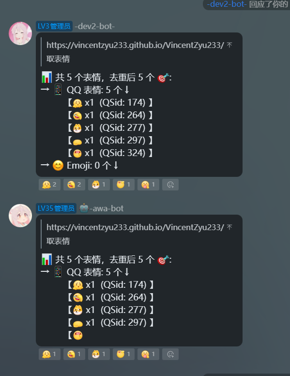
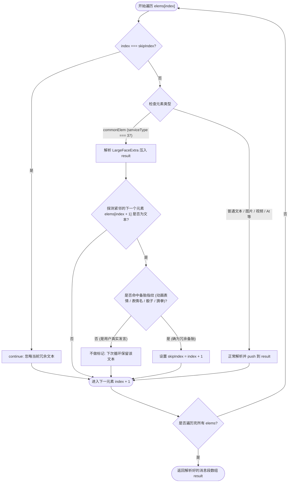

# 适配 LLOneBot 与 NapCat 混排超级表情与贴表情差异规划文档

## 📌 问题背景与根因
- **现象**：在群聊触发「取表情」时，NapCat (`dev-bot`) 发送完整消息，而 LLOneBot (`awa-bot` / `dev2-bot`) 均截断在 `QSid: 324`（/吃糖 🫣）处。
- **根因**：
  1. QQ 协议中超级表情（带 `AniStickerType`）单发为全屏大表情（`serviceType: 37`），图文混排时在 QQ 客户端呈现为小黄脸。
  2. LLOneBot 发送端不管混排与否强制打包为大表情（导致 QQ 客户端渲染截断），且在接收端 `messageParsing.ts` 的 `svcType === 37` 分支内错误调用了 `break`（导致解析循环提前跳出）。

---

## 🚀 三阶段实施规划

### 阶段 1：51 机器 `llbot-dev2` Docker 容器热补丁验证（已完成 ✅）
- **动作**：
  1. 登录 51 机器，定位运行产物 `llbot.js`。
  2. 同时修复发送端混排降级（`serviceType: 33`）与接收端移除 `break`。
  3. 热重启 `dev2` 验证，实测已能像 NapCat 一样输出完整消息（含 324、后续文字及 Emoji）。
- **实测成果对照**：
  

### 阶段 2：上游 TS 源码深度修复与三步闭环推进（已完成 ✅）

#### 阶段 2A：基础混排修复与初版 PR（已完成 ✅）
- **目标**：解决图文混排时超级表情（如 324 🫣）强制大表情导致的渲染截断问题。
- **动作**：
  1. 在 `D:\temp\gemini\LuckyLilliaBot` 提交 PR #866，完成本地构建与群内实测验证通过。

#### 阶段 2B：Sourcery-ai 审查点验证与专业反驳（已完成 ✅）
- **结论**：**不采纳 Sourcery 建议，维持阶段 2A 降级为 `serviceType: 33` 方案。**
- **实测铁证**：
  1. 真实网络环境实测：若混排时保留 `serviceType: 37`，腾讯 QQ 服务端直接判定为非法数据包并拒收，当场抛出 `retcode: 1200` 导致整条消息发送失败。
  2. 官方客户端规范：官方手机 QQ 客户端在图文混排时，骰子/超级表情本身就是以行内小表情形式显示（如 `测试骰子点数：🎲`）。
  3. 已在 PR #866 对应的 Code Review 线程中回贴真实测试数据与 `retcode 1200` 报错现场完成打脸与专业闭环：[查看回复](https://github.com/LLOneBot/LuckyLilliaBot/pull/866#discussion_r4136629312)。

#### 阶段 2C：维护者予云叶（yeye2025）审查点 —— 接收端精准剔除 fallback 降级文字（已完成 ✅）
- **结论**：**采用 `skipIndex` 精准跳过紧随其后的 fallback 降级文本，替代原有的 `break` 语句。**
- **验证成果**：
  1. 复现成功：移除了 break 的初版代码在接收单发大表情时，会解析出多余的 `[吃糖]` 尾巴。
  2. 修复部署：在 `messageParsing.ts` 中通过探测 `nextElem` 结合 `skipIndex = index + 1` 针对性跳过 fallback 文本（支持 `[表情名]`、`[动画表情]`、`[骰子]`、`[包剪锤]` 等），且不打断后续解析。
  3. Commit 落地：已提交 Commit [`6296b9ee`](https://github.com/LLOneBot/LuckyLilliaBot/pull/866/commits/6296b9eee3e886d1958d1cad642d8e2c1485791c) 到 PR #866。
  4. 架构复盘：已在 PR #866 中发布 NapCat 与 LLOneBot 的全量文件/行号/Hash/架构差异对比评论：[查看评论](https://github.com/LLOneBot/LuckyLilliaBot/pull/866#issuecomment-5896358564)。
  5. 细节润色与提交积累：持续完善协议注释与文档索引，累计贡献 7 个高质量 Commit。

---

## 💡 根治方案技术内幕：LLOneBot 上游 PR #866 深度复盘

### 1. 为什么上游修复才是“终极根治”？
- **插件层降级（阶段 3）是“守住自己”**：当识别到旧版 LLOneBot 时，将表情转为 Unicode Emoji 避免触发 Bug。但这属于**受迫妥协**，别的插件或原生 QQ 用户发送的混排大表情依然会在旧版 LLOneBot 面前粉碎。
- **协议端修复（PR #866）是“造福生态”**：从 NTQQ 协议转换层彻底校正报文组装与解析规则，让 QQ 的底层 Protobuf 元素双向无损流通。

---

### 2. 发送端（`sendMsg.ts`）：混排合法性判定与防呆校验

#### 腾讯协议底层铁律
- **单体大招模式**：`serviceType: 37`（`LargeFaceExtra`）在腾讯服务端协议规范中，**必须且只能作为单体独立消息发送**（即消息段数组长度为 1）。
- **混排死罪**：如果与其他文字、图片混排（长度 > 1）时强行传 37，腾讯服务端会直接判定为报文畸形而拒收，抛出 **`retcode: 1200`** 导致发送整条消息失败！
- **官方客户端行为**：官方手机 QQ 在用户混排输入超级表情时，底层自动降级打包为 `serviceType: 33`（`QSmallFaceExtra` 行内小表情）。

#### 修复核心逻辑
```typescript
} else if (faceElement.faceType === 3 && this.inputElems.length === 1) {
  // 腾讯协议约束：超级大表情 LargeFaceExtra 必须单独发送（数组长度为 1）
  // 此时才视为合法的大表情调用，构造 serviceType: 37
  const pbElem = Msg.LargeFaceExtra.encode({ ... })
  this.outputElems.push({ commonElem: { serviceType: 37, pbElem } })
} else if (faceElement.faceType === 1 || faceElement.faceType === 2 || faceElement.faceType === 3) {
  // 混排降级：若 faceType === 3 但消息段长度 > 1，降级为行内小表情 serviceType: 33
  const pbElem = Msg.QSmallFaceExtra.encode({ faceId: faceElement.faceIndex, text: faceElement.faceText })
  this.outputElems.push({ commonElem: { serviceType: 33, pbElem } })
}
```

---

### 3. 接收端（`messageParsing.ts`）：从 `break` 斩首到 `skipIndex` 定点剔除

#### 腾讯下发超级大表情的报文结构
腾讯向客户端下发 37 大表情时，为向下兼容不支持大表情的旧设备，会紧随其后附带一个**兜底/备胎文本元素**：
- `elems[0]`: `commonElem { serviceType: 37 }`（超级表情本尊）
- `elems[1]`: `textElement { str: "[吃糖]" }` 或 `[动画表情]`（给塞班/老客户端看的兜底文本）

#### 历史原罪与根治对照
- **原版做法（斩首式 `break`）**：原作者为了不让用户收到重复的 `[CQ:face,id=324][吃糖]`，在解析完 37 后直接执行 `break` 终止循环。
  - **严重后患**：如果消息后面还有文字、图片、At 元素，`break` 会导致**后续所有元素全部瞬间人间蒸发**！
- **PR #866 根治做法（微创式 `skipIndex`）**：
  - 不跳出主循环（永不使用 `break`）；
  - 精准探测紧随其后的元素 `elems[index + 1]` 是否为当前大表情的兜底备胎；
  - 命中备胎时，记录 `skipIndex = index + 1`，在下一轮循环中通过已有的 `if (index === skipIndex) continue` 单点跳过；
  - 循环继续正常运行，后续元素毫发无损！

#### 为什么能做到“不漏”与“不重”？
- **不漏（四层指纹全面覆盖）**：
  1. `nextStr === '[动画表情]'`：捕获较新 NTQQ 客户端下发的通用兜底占位符；
  2. `nextStr === `[${faceName}]``：捕获标准中括号表情名（如 `[吃糖]`、`[菜汪]`）；
  3. `nextStr === face.QDes`：捕获部分旧协议保留的原生斜杠描述（如 `/吃糖`）；
  4. `faceIndex === 358 / 359`：捕获特殊互动表情的独有备胎文本（`[骰子]`、`[包剪锤]`、`[剪刀石头布]`）。
- **不重（三重严密死锁护航）**：
  1. **时空强绑定**：只在当前元素确为 `serviceType: 37` 且目标是紧邻的 `elems[index + 1]` 时才审查，群友日常打字普通文本根本不会进此分支；
  2. **钥匙对锁芯**：`faceName` 严格绑定当前表情，发 `324(吃糖)` 绝不会去误杀 `[大笑]` 或 `[今天真好]`；
  3. **空值短路保护**：`faceName &&` 短路运算符彻底防止未知表情被转化为 `"[undefined]"` 导致误判。

---

### 4. 接收端解析流水线流程图（Mermaid）



---

### 5. PR #866 提交演进全记录

| Commit Hash | 提交信息 | 核心演进目标与技术动作 |
| :--- | :--- | :--- |
| `a42c169d` | `fix(msg): 修复图文混排时超级表情导致的截断与接收端解析中断` | 初版建立：发送端混排降级 33，接收端移除旧版 `break` |
| `6296b9ee` | `fix(msg): 接收超级大表情时跳过紧随其后的降级文本段` | 解决 review 痛点：引入 `skipIndex` 精准跳过降级文本段，不留多余尾巴 |
| `a2aa7590` | `docs(msg): 完善超级表情 fallback 降级文本跳过逻辑注释与实测案例` | 补充四种 fallback 匹配规则与实测场景详细注释 |
| `f9cef0d1` | `docs(msg): 补充发送端混排超级表情的 QQ 服务端协议约束与防呆说明` | 阐明腾讯服务端 37 必须单发的底层协议铁律与防呆设计 |
| `34869a36` | `docs: 补充超级表情与多元素图文混排协议降级机制文档索引` | 为代码模块关联协议降级与多元素混排机制的技术文档索引 |
| `9fba3539` | `docs(msg): 补充发送端混排降级判定与单体合法性校验注释` | 在 `sendMsg.ts` 补充长度等于 1 的 and 判定与混排 or 判定注释 |
| `84efc7a2` | `docs(msg): 进一步润色发送端混排判定与消息段长度约束注释措辞` | 严谨润色 `LargeFaceExtra` 约束说明，避免歧义，提升代码审查体验 |

---

### 阶段 3：Koishi 插件临时防御妥协兼容与 PR 合并（保全生产旧版 LLOneBot 避免截断，已完成 ✅）
- **目标**：针对上游尚未合并 PR #866、无法停机升级的旧版本 LLOneBot 实例（如 84 生产环境 `awa-bot`），提供**防御性妥协让步机制**，换取整条消息绝不被截断腰斩的底线可用性。
- **代价与瑕疵说明**：
  - **绝非真正的“无感兼容”**：该方案存在**肉眼可见的视觉瑕疵与体验让步**。开启后，原本应显示的 QQ 原生大头动画表情（如 324 吃糖、317 菜汪）会被强制降级替换为系统通用 Unicode Emoji（如 `🫣`、`🐶`）或文字，在 QQ 客户端无法展现原生表情动效。
  - **纯属过渡妥协**：这是在协议端（LLOneBot）尚未修复前的“两害相权取其轻”（宁可表情降级为 Emoji，也绝不能让整句话被腰斩蒸发）。
  - **推荐使用姿态**：默认关闭（`false`），标记为 `.experimental()`。一旦上游合并发布了修复版 LLOneBot，用户应直接升级协议端并关闭此开关，享受完全原汁原味的原生混排体验。
- **动作**：
  1. 在 `auto-emoji-onebot-vincentzyu` 插件创建分支 `fix/llbot-super-face-compat`。
  2. `config.ts` 拆分实现枚举，采用与 `onebot-info-image` 一致的双 Emoji 风格：
     - `✨🤖 自动检测（推荐，智能识别 NapCat / LLBot / Lagrange）`
     - `🐈💙 NapCat（调用 set_msg_emoji_like）`
     - `🤖🩷 LLBot (Lucky Lillia Bot，调用 set_msg_emoji_like)`
     - `🧐💜 Lagrange V1（调用 set_group_reaction）`
  3. 新增 `llbotSuperFaceCompat` 配置开关：
     - **属性配置**：默认关闭（`false`），明确标注 `.experimental()`。
     - **妥协机制说明**：该配置在 description 和文档中明确标注**并非根治方案，仅为插件层的临时妥协让步**；彻底根治需要上游修复 LLOneBot 自身协议缺陷（作者已提交 PR：[LLOneBot/LuckyLilliaBot#866](https://github.com/LLOneBot/LuckyLilliaBot/pull/866)，截至 2026年9月30日 尚未合并）。
     - **渲染行为**：在 `pick.ts` 提取表情时，若开启此实验性保护且当前为 LLOneBot 实例，对具有全屏动画属性的超级表情（如 324 吃糖、317 菜汪 等）智能降级输出 Unicode Emoji（如 `🫣`、`🐶`）或安全文本形态，彻底杜绝老版本客户端在图文混排时的截断崩溃。
  4. 新增 4 个小写短横线协议测试指令：`test-dice`、`test-rps`、`test-super-large`、`test-all-large-face-extra`（带 111ms 间隔）。
  5. 使用 `gh` CLI 提交 PR [#1](https://github.com/VincentZyuApps/koishi-plugin-auto-emoji-onebot-vincentzyu/pull/1) 并合并到 `main` 分支，正式 bump 版本号至 `0.3.1-beta.7+20260930`。
  6. 本地 Windows LLOneBot 调试进程已退出，51 Macbook 上的 `llbot-dev2` 容器已恢复运行并配置 DNS/代理支持。
