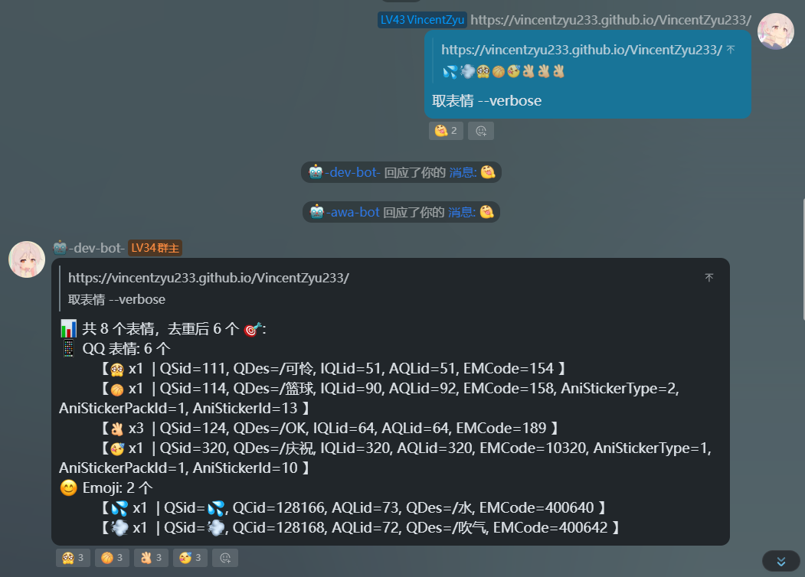
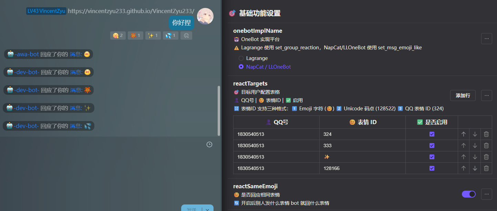
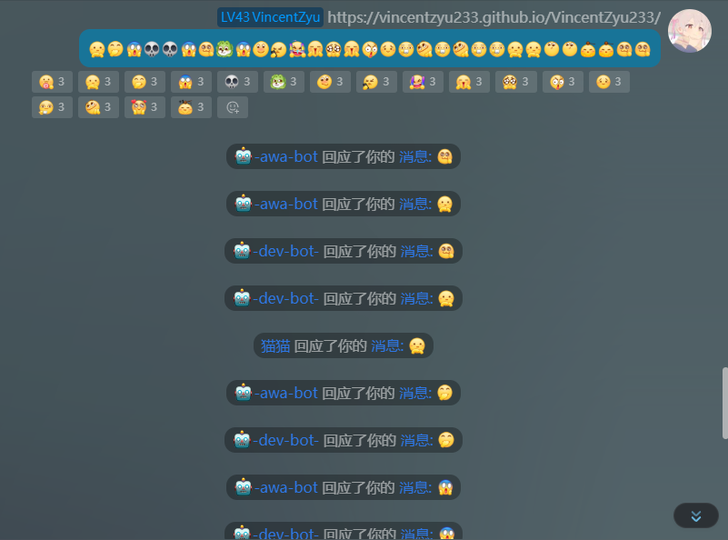

# 🤖 koishi-plugin-auto-emoji-onebot-vincentzyu

[](https://www.npmjs.com/package/koishi-plugin-auto-emoji-onebot-vincentzyu)
[](https://www.npmjs.com/package/koishi-plugin-auto-emoji-onebot-vincentzyu)

[](https://github.com/VincentZyuApps/koishi-plugin-auto-emoji-onebot-vincentzyu)
[](https://gitee.com/vincent-zyu/koishi-plugin-auto-emoji-onebot-vincentzyu)

[](https://qm.qq.com/q/ZN7fxZ3qCq)

<p>💬 插件使用问题 / 🐛 Bug反馈 / 👨‍💻 插件开发交流，欢迎加入QQ群：<b>1085190201</b> 🎉</p>
<p>💡 在群里直接艾特我，回复的更快哦~ ✨</p>

# 🤖 让 bot 自动给你的群友消息添加表情回应！✨

## ⚠️ 重要提示

**🔴 本插件需要前置插件 `koishi-plugin-adapter-onebot` 才能正常使用！**

请确保在 Koishi 控制台中已经安装并启用了以下插件：
- 📦 `koishi-plugin-adapter-onebot` - OneBot 适配器

如果没有安装该插件，本插件将无法工作！

---

## 🚀 功能介绍

Koishi 插件，自动对指定群友的消息添加表情回应，也支持对消息中的 QQ 表情回复相同表情。包含以下功能：

| 功能 | 说明 |
|---|---|
| 🤖 **自动表情回应** | 对配置的 QQ 号列表中的用户，自动给他们的消息加上指定表情 |
| 😊 **回复相同表情** | 别人发 QQ 表情时，bot 自动回复相同的表情 |
| 📋 **取表情指令** | 引用消息后提取其中的所有 QQ 表情，去重并排序输出 |

## 📖 使用方法

### 1. ⚙️ 配置项

在 Koishi 控制台插件配置中设置：

| 配置 | 类型 | 默认值 | 说明 |
|---|---|---|---|
| onebotImplName | radio | NapCat / LLOneBot | 选择你的 OneBot 实现平台（Lagrange / NapCat / LLOneBot） |
| reactTargets | table | QQ号=1830540513, 表情ID=324, 启用=是 | 目标用户表格：设置QQ号、表情ID（支持 emoji 字符/Unicode 码点/QQ ID）、是否启用 |
| reactSameEmoji | boolean | true | 是否对消息中的 QQ 表情回复相同表情 |
| enablePickFace | boolean | true | 是否启用「取表情」指令 |
| verboseConsoleOutput | boolean | true | 是否在控制台打印调试日志 |

#### ✨ 表情 ID 输入格式

`reactTargets` 表格中的「表情 ID」支持三种输入格式：

| 格式 | 说明 | 示例 |
|---|---|---|
| 1️⃣ **Emoji 字符** | 直接输入 emoji 字符 | `😊` `👍` `❤️` |
| 2️⃣ **Unicode 码点** | 输入 emoji 的 Unicode 十进制码点 | `128522`（对应 😊） |
| 3️⃣ **QQ 表情 ID** | 传统的 QQ 表情 ID | `324` |

💡 **配置示例：**
- QQ号: `1830540513`，表情ID: `😊` ✅
- QQ号: `1830540513`，表情ID: `128522` ✅
- QQ号: `1830540513`，表情ID: `324` ✅

### 2. 📋 取表情指令

引用一条包含 QQ 表情的消息，发送指令提取所有 QQ 表情（去重排序），先拿到表情 ID：

```
取表情
取表情 -v      # 显示详细信息（所有字段）
取qq表情       # alias
pick-face      # alias
pick-face -v   # verbose mode
```

**普通输出示例：**
```
📊 共 8 个表情，去重后 3 个 🎯:
	😊 x5  (ID: 14)
	😄 x2  (ID: 20)
	🍬 x1  (ID: 324)
```

**详细输出示例（-v 参数）：**
```
📊 共 8 个表情，去重后 3 个 🎯:
	【😊 x5  | QSid=😊, QCid=128522, AQLid=..., QDes=微笑, EMCode=... 】
	【😄 x2  | QSid=😄, QCid=128516, AQLid=..., QDes=大笑, EMCode=... 】
	【🍬 x1  | QSid=🍬, QCid=127852, AQLid=..., QDes=糖果, EMCode=... 】
```



💡 拿到表情 ID 后，再到「自动表情回应」的配置表格里填入对应的 QQ 号和表情 ID 即可 🎯

> 🔍 在线查找 QQ 表情 ID：
> - 📖 [【koishihs-QFace】 在线查阅网页](https://koishi.js.org/QFace/#/qqnt)
> - 📦 [【koishijs-QFace】 face_config.json](https://github.com/koishijs/QFace/blob/master/public/assets/qq_emoji/face_config.json)
> - 🗃️ [【NapCatQQ】 face_config.json](https://github.com/NapNeko/NapCatQQ/blob/main/packages/napcat-core/external/face_config.json)

### 3. 🤖 自动表情回应

配置好 `reactTargets` 表格后，当列表中的用户发消息时，bot 会自动对其消息添加配置的表情。

> 默认配置：QQ号 `1830540513`，表情 `324`（吃糖）



### 4. 😊 回复相同表情

开启 `reactSameEmoji` 后，当有人在群里发 QQ 表情时，bot 会自动回复相同的表情。



## 🗂️ 文件结构

```
src/
├── index.ts       插件入口
├── type.ts        类型定义（OneBotImpl, Config, ReactionTarget 等）
├── config.ts      Schema 配置（Koishi 配置界面）
├── emoji-react.ts 表情回应核心逻辑（addEmojiReaction + 两个 handler）
├── pick-face.ts   取表情指令实现
├── face-config.ts QQ Emoji 和 SysFace 配置数据（自动生成）
└── usage.ts       插件使用说明（Koishi 控制台显示）
```

## ⚠️ 注意事项

- ✅ 需要安装并启用 `koishi-plugin-adapter-onebot`
- 🎯 Lagrange 使用 `set_group_reaction` API，NapCat/LLOneBot 使用 `set_msg_emoji_like` API
- ⚙️ 请在插件配置的「OneBot 实现平台」中选择与你实际部署一致的选项
- 📋 取表情指令需要引用一条消息后才能使用
- 🐛 开启 `verboseConsoleOutput` 可查看更多调试信息

## 🙏 致谢

本插件能够实现 QQ 内置表情贴图与 emoji 相关功能，离不开下面这些开源项目提供的参考与帮助：

- **[koishijs/QFace](https://github.com/koishijs/QFace)** - QQ 表情数据维护项目，提供了完整的 QQ 表情映射与查阅参考 → [📖 在线查阅](https://koishi.js.org/QFace/#/qqnt)
- **[NapCatQQ](https://github.com/NapNeko/NapCatQQ)** - 本插件使用的 `assets/face_config.json` 参考自 NapCatQQ 项目的 `packages/napcat-core/external/face_config.json`

感谢这些项目的贡献者们，让这部分能力能够更顺利地落地。🎉
